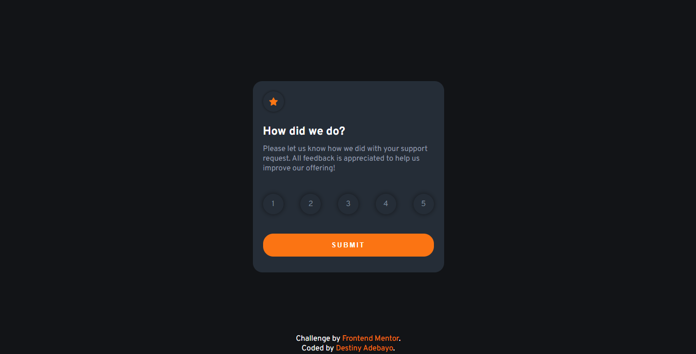

# Frontend Mentor - Interactive rating component solution

This is a solution to the [Interactive rating component challenge on Frontend Mentor](https://www.frontendmentor.io/challenges/interactive-rating-component-koxpeBUmI). Frontend Mentor challenges help you improve your coding skills by building realistic projects.

## Table of contents

- [Overview](#overview)
  - [The challenge](#the-challenge)
  - [Screenshot](#screenshot)
  - [Links](#links)
- [My process](#my-process)
  - [Built with](#built-with)
  - [What I learned](#what-i-learned)
  - [Continued development](#continued-development)
  - [Useful resources](#useful-resources)
- [Author](#author)

**Note: Delete this note and update the table of contents based on what sections you keep.**

## Overview

### The challenge

Users should be able to:

- View the optimal layout for the app depending on their device's screen size
- See hover states for all interactive elements on the page
- Select and submit a number rating
- See the "Thank you" card state after submitting a rating

### Screenshot



### Links

- Solution URL: [Solution](https://github.com/ProfessorDy/interactive-rating-card)
- Live Site URL: [live site URL](https://interactive-rating-cardc.netlify.app/)

## My process

- I started by writing the HTML markup
- Created a 'card' class for both states since the card should be identical
- Added a display of none to the final card state
- Designed both cards separately by using different classnames for their elements
- Used JavaScript to select both cards and toggle
- Toggled on a "submit" event listener
- Uploaded to GitHub

### Built with

- Semantic HTML5 markup
- CSS custom properties
- Flexbox
- Mobile-first workflow

### What I learned

- I learnt how to apply custom styling to the radio buttons. initially I thought it would be difficult but turns out you just have to set the input button itself to a display of none, and style the label. However, to style the label itself to remain a checkbox, you would need to use a syntax that allows you to select the input using a 'checked' pseudoclass and a '+' to add the label to it and then style. Code below:

```
css
-----
.rating-form input[type="radio"]{
    display: none;
}
.rating-form input[type="radio"]:checked + label {
    color: var(--white);
    background-color: var(--light-grey);
}
```

- I also created a submit state and added a custom class of "display: none" to it. I then listened for a 'submit' event and toggled the class on both card (adding the 'hide' class to the initial card and removing it from the "thank you state" card). However, this only lasted for a split second and reverted to the initial state. After doing some research I discovered that I would have to apply a method to the form in order to prevent the default state(automatically refresh page on submit). Code Below

```
JavaScript
-----
const changeState = (e) => {
    e.preventDefault()

    cards.forEach(card => {
        card.classList.toggle('hide')
    });

    const data = new FormData(e.target)
    const ratingValue = data.get('rating')

    rating.textContent = ratingValue
}

form.addEventListener('submit', changeState)
```

### Continued development

I would love to learn more about forms. It was a very interesting project for me!

### Useful resources

- [CSS Styling](https://codepen.io/w3programmings/pen/zzRKpy?editors=1100) - This gave me an idea of how I should style the radio buttons. I really liked this pattern and will use it going forward. I will also apply same concept to other input types.

- [JavaScript Forms](https://matiashernandez.dev/blog/post/handling-forms-with-vanilla-javascript) - This is an amazing article which helped me finally understand how to manipulate form data properly. I'd recommend it to anyone still learning this concept.

## Author

- Website - [Destiny Adebayo](https://destiny-dev.onrender.com/)
- Frontend Mentor - [@Dy-Prof](https://www.frontendmentor.io/profile/Dy-prof)
- GitHub - [@ProfessorDy](https://github.com/ProfessorDy)
